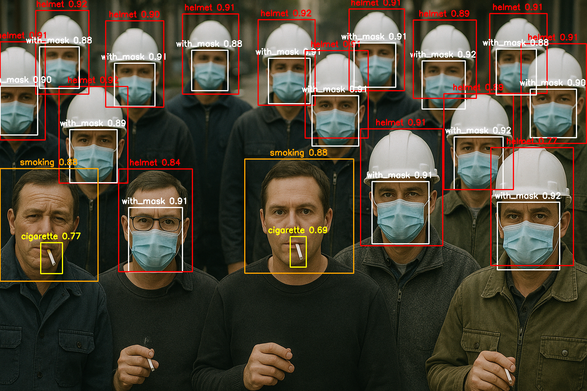

# P8GP-G01: Advanced Object Detection System

<div align="center">


*A real-time safety monitoring system powered by AI and deep learning*

</div>

---

## Overview

**P8GP-G01** is a real-time object detection system engineered for safety monitoring applications. Leveraging YOLO models (YOLOv5n and custom-trained variants), the system detects critical safety equipment and hazardous situations including **Helmets**, **Face Masks**, **Smoking**, **Fire**, and **Smoke**.

The system features a PyQt6-powered graphical interface with real-time monitoring, automated image saving, and detection analytics. It supports multiple camera sources across Windows, Linux, and macOS.

---

## Screenshots

<div align="center">


*Main application interface with real-time detection*


*Helmet, mask, and smoking detection in action*

</div>

---

## Detection Capabilities

| Type | Description | Use Case |
|---|---|---|
| 🦺 Safety Helmets | Hard hat and protective headgear detection | Construction & industrial sites |
| 😷 Face Masks | Medical and protective mask identification | Healthcare & public safety |
| 🚬 Smoking | Cigarette and smoking activity recognition | No-smoking zone enforcement |
| 🔥 Fire | Flame and fire hazard identification | Emergency response |
| 💨 Smoke | Smoke plume and vapor detection | Early warning systems |

---

## System Requirements

| Component | Minimum | Recommended |
|---|---|---|
| OS | Windows 10, Ubuntu 18.04+, macOS 10.15+ | Latest stable versions |
| Python | 3.10+ | 3.11+ |
| RAM | 4 GB | 8 GB+ |
| Storage | 2 GB | 5 GB+ |
| Camera | USB 2.0 webcam | USB 3.0 HD webcam |
| CPU | Dual-core 2.0 GHz | Quad-core 2.5 GHz+ |

---

## Installation

### 1. Clone the Repository
```bash
git clone https://github.com/Amin-Moniry/P8GP-G01.git
cd P8GP_G01
```

### 2. Set Up Virtual Environment
```bash
python -m venv venv

# Windows
venv\Scripts\activate

# Linux / macOS
source venv/bin/activate
```

### 3. Install Dependencies
```bash
cd UI
pip install -r requirements.txt
```

### 4. Verify AI Models
Ensure the following model files are present in `UI/Models/`:

| Model | Status |
|---|---|
| `Fire_Detection.pt` | ✅ Required |
| `Helmet_Detection.pt` | ✅ Required |
| `Mask_Detection.pt` | ✅ Required |
| `Smoking_Detection.pt` | ⚠️ Optional |

### 5. Run the Application
```bash
python Codes/Application.py
```

---

## Key Dependencies

```
torch==2.3.1
opencv-python==4.9.0.80
numpy==1.26.4
ultralytics==8.1.0
PyQt6==6.6.1
pygrabber==0.2          # Windows only — enhanced camera detection
```

---

## Project Structure

```
P8GP_G01/
├── LICENSE
├── .gitignore
├── README.md
├── Project_Picture/         # Screenshots
└── UI/
    ├── Codes/               # Application source code
    │   ├── Application.py   # Entry point
    │   ├── MainWindow.py
    │   ├── DetectionEngine.py
    │   ├── CameraManager.py
    │   └── ...
    ├── Models/              # AI model files (.pt)
    ├── Images/              # Detection output storage
    ├── Imgs/                # UI assets
    └── requirements.txt
```

---

## Usage

1. **Welcome Screen** — Launch the app and click **"Get Started"**
2. **Select Camera** — Choose from available devices in the control panel
3. **Start Detection** — Press **▶ Play** to begin real-time monitoring
4. **View Results** — Detection overlays and confidence scores appear on the live feed
5. **Save Images** — Enable image saving to automatically categorize detections by type
6. **Browse Gallery** — Review saved detections organized by category (Masks, Helmets, Fire, etc.)

---

## Project Information

<div align="center">

| Attribute | Value |
|---|---|
| Version | `2.1` |
| Release Date | April 25, 2026 |
| Development Location | Tabriz, Iran 🇮🇷 |
| Primary Language | Python |
| GUI Framework | PyQt6 |
| AI Framework | YOLO (Ultralytics) |

</div>

---

## Development Team

| Role | Name |
|---|---|
| Lead Developer & UI Designer | **Amin Moniry** (AminTivanix2) |
| Project Supervisor & Technical Advisor | **Saeed Shokraneh** |

---

## License

This project is protected under a **Non-Commercial License**.

- ✅ Permitted: Personal use, education, research, open-source contributions
- ❌ Prohibited: Commercial use, revenue generation, corporate deployment
- 📋 Required: Attribution to original authors and license inclusion in distributions

**© 2026 Amin Moniry (AminTivanix2) — All Rights Reserved**

---

## Contact & Support

<div align="center">

| Channel | Link |
|---|---|
| 📧 Email | [amintivanix2@gmail.com](mailto:amintivanix2@gmail.com) |
| 💻 GitHub | [Amin-Moniry](https://github.com/Amin-Moniry) |
| 📱 Telegram | [@amintivanix2](https://t.me/amintivanix2) |
| 🌐 Website | [allin1wrench.ir](https://allin1wrench.ir) |
| 🐛 Issues | [GitHub Issues](https://github.com/Amin-Moniry/P8GP-G01/issues) |

</div>

---

<div align="center">

*Built with ❤️ in Tabriz, Iran*


</div>
